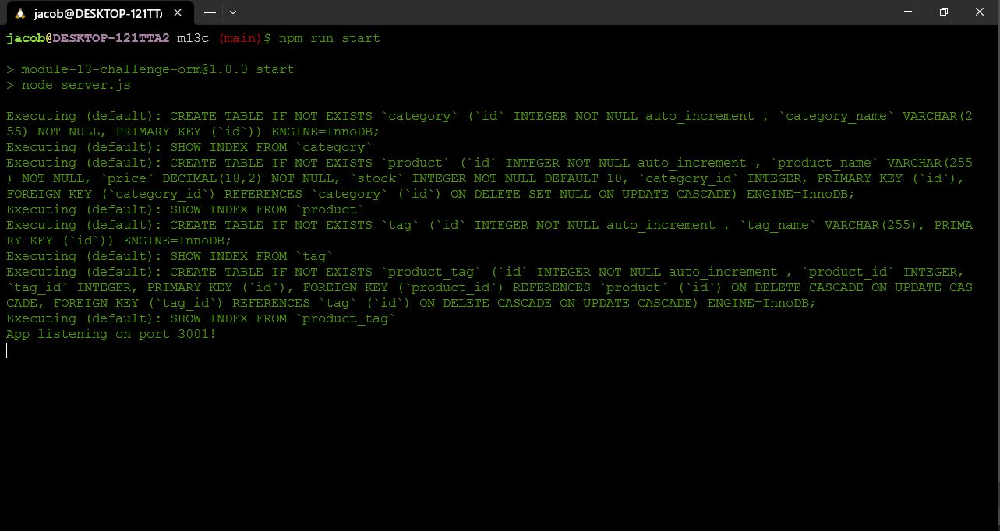

# E-commerce Sequelize Backend API's - Module 13 Challenge

## Description

This small application is an exercise in using Sequelize as an ORM, and structuring a backend Express server to use Sequelize to create CRUD routes. This application does not have a frontend, but can be used with Insomnia or Postman. Demonstration of this application is done using Insomnia & WSL:1 using Ubuntu 22.04. 

https://insomnia.rest/

https://www.postman.com/



## Installation

1. Start by cloning the Git Repository from this GitHub repository: https://github.com/Jacob-Jeffries/m13c
```
$ git clone git@github.com:Jacob-Jeffries/m13c.git
```
2. Navigate to the working directory of this repo.
```
$ cd m13c
```
3. Initialize node packages
```
$ npm i
```
4. Make sure that your MySQL server is running, on Ubuntu:
```
$ sudo /etc/init.d/mysql start
```
5. Open a MySQL session using your username and password
6. Set up the database using the ./db/schema.sql file:
```
mysql> source ./db/schema.sql
~
mysql> exit
```
7. Open VS Code (or another editor) and create a .env file, then add your username and password. This should be structured the same way as in the .env.Example file.
```
DB_NAME = 'employees_db'
DB_USER = ''
DB_PASS = ''
```
8. Once back at the terminal, seed your database, you will see completion messages for each table that is seeded.
```
$ npm run seed
```
9. To start the application, start the express server:
```
$ npm run start
```

## Usage

Prior to using this application, either Insomnia or Postman must be installed, please follow relevant documentation at the links above. 

1. Once the application is installed, seeded, and the express server has been started: Start Insomnia.
2. The server is running on http://localhost:3001
3. Each api route contains a "find all" route using GET HTTP protocol
    1. /api/products/
    2. /api/categories/
    3. /api/tags/
4. Each api route contains a find by id route using GET HTTP protocol, where id is the primary key id of the respective table
    1. /api/products/:id
    2. /api/categories/:id
    3. /api/tags/:id
5. Each api route contains Create New (POST Protocol), Update By Id (PUT Protocol), and a Delete By Id (DELETE Protocol). 
6. Please watch the linked video below for examples of using each of these API routes, and to see examples of the returned JSON data from each API route.

https://www.youtube.com/watch?v=PyK0q-Gej_0

## Credits

Coded by Jacob Jeffries

With starter code provided by MSU Bootcamp:
https://github.com/coding-boot-camp/fantastic-umbrella

### Packages & Software Used
* Node.js v18.13.0
* npm v8.19.3
* dotenv v16.0.3
* express v4.17.1
* mysql2 v3.2.0
* nodemon v2.0.3
* Insomnia v2023.1.0

## License

MIT License

Copyright (c) [2023] [Jacob Jeffries]

Permission is hereby granted, free of charge, to any person obtaining a copy
of this software and associated documentation files (the "Software"), to deal
in the Software without restriction, including without limitation the rights
to use, copy, modify, merge, publish, distribute, sublicense, and/or sell
copies of the Software, and to permit persons to whom the Software is
furnished to do so, subject to the following conditions:

The above copyright notice and this permission notice shall be included in all
copies or substantial portions of the Software.

THE SOFTWARE IS PROVIDED "AS IS", WITHOUT WARRANTY OF ANY KIND, EXPRESS OR
IMPLIED, INCLUDING BUT NOT LIMITED TO THE WARRANTIES OF MERCHANTABILITY,
FITNESS FOR A PARTICULAR PURPOSE AND NONINFRINGEMENT. IN NO EVENT SHALL THE
AUTHORS OR COPYRIGHT HOLDERS BE LIABLE FOR ANY CLAIM, DAMAGES OR OTHER
LIABILITY, WHETHER IN AN ACTION OF CONTRACT, TORT OR OTHERWISE, ARISING FROM,
OUT OF OR IN CONNECTION WITH THE SOFTWARE OR THE USE OR OTHER DEALINGS IN THE
SOFTWARE.
